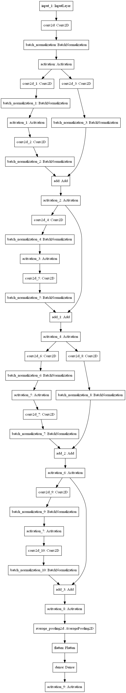

# NCU Algorithm Team Project (1092)
[](https://www.python.org/doc/versions/)
[](https://colab.research.google.com/drive/1vYnJcEign6TZ3KaAwijwjvxwPTjbyESV?usp=sharing)

## Requirements
This project is written by Python 3.8.7 . Following packages are need to be installed.
- tensorflow~=2.4.1
- pydot>=1.4.2


## Installation

```shell script
git clone https://github.com/ppodds/NCUAlgorithmTeamProject.git
python -m pip install -r requirements.txt
```

## Usage

You can use Google Colab or run at your own computer. [Link](https://colab.research.google.com/drive/1vYnJcEign6TZ3KaAwijwjvxwPTjbyESV?usp=sharing)
If you want to use Colab, you should mount your own google drive (prepare dataset).

If you want to run this in your own computer, you should check your project structure is correct.
Check your dataset path is correct. The path is strictly required to be correct 

## Screenshot (Running on Colab)

### ResNet 9 model


### ResNet 152 model


## Project Structure

```
project
│   README.md
│   .gitignore
│   requirements.txt    
│
└───NumberDectect
│   │   main.py
│   │
│   │
│   └───ChineseNumDataset
│   │   │   train_image
│   │   │   test_image
│   │
│   └───commands
│   │   │   __init__.py
│   │   │   evaluate.py
│   │   │   info.py
│   │   │   train.py
│   │ 
│   └───dataset
│   │   │   __init__.py
│   │
│   └───model
│   │   │   __init__.py
│   │   │   ResNet.py
│   │   │
│   │   └───layers
│   │   │  │   __init__.py
│   │   │  │
```

## ResNet Structure

### ResNet 9 model

[source](https://blog.csdn.net/yyyerica/article/details/86541473)

<table>
  <tr>
  <th>Layer Name</th>
    <th>Output size  </th>
    <th>Detail</th>
  </tr>
  <tr>
  <th>Conv1</th>
    <td>28x28x16</td>
    <td>3x3, 16, stride 1</td>
  </tr>
  <tr>
  <th>Conv2</th>
    <td>14x14x16</td>
    <td>3x3, 16, stride 2 (shortcut)</td>
  </tr>
  <tr>
  <th>Conv2</th>
    <td>14x14x16</td>
    <td>3x3, 16, stride 1 </td>
  </tr>
  <tr>
  <th>Conv3</th>
    <td>7x7x32</td>
    <td>3x3, 16, stride 2 (shortcut)</td>
  </tr>
  <tr>
  <th>Conv3</th>
    <td>7x7x32</td>
    <td>3x3, 16, stride 1</td>
  </tr>
  <tr>
  <th>Avg</th>
    <td>1x1x32</td>
    <td>7x7 average pool</td>
  </tr>
  <tr>
  <th>Output</th>
    <td>10</td>
    <td>flatten, dense, softmax</td>
  </tr>
</table>

